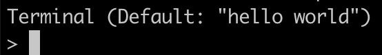

# `console`

交互式命令行功能，类似于在浏览器控制台调试 `javascript` 的能力，可帮助提升开发者排查问题的效率，当执行命令：
```bash
php public/cli.php console
```
会进入到如下的状态：  

这里直接输入 `php` 代码即可，显示的逻辑也与浏览器控制台类似：
1. 可以单句执行
2. 执行时可以使用前边语句中声明的变量
3. 执行时默认会将语句的返回值以 `var_dump` 方法打印出来
4. 键入 `tab` 时，会按照一定的规则去补全
5. 可以调用和使用框架中的方法、类

补全规则是遵循框架推荐的命名规则的，如：

1. 变量名默认会提供已声明实体的单数复数命名补全
```bash
Terminal (Default: "hello world")
> $
cate   cates  good   goods
> $
```

2. 当变量名称为实体单复数时，等于号后的补全选项中会有该实体对应的 `dao` 及查询方法，单数变量会补全 `find_` 前缀，复数变量会补全 `find_all` 前缀方法
```bash
Terminal (Default: "hello world")
> $good = dao('good')->find
find($id_or_ids)                           find_by_column($columns)                   find_by_foreign_key($foreign_key, $value)
> $good = dao('good')->find
```

3. 当变量名为实体单数时，`->` 后可以补全实体相关的 `public function`、`structs`、以及关联关系，关联关系也可继续补全
```bash
Terminal (Default: "hello world")
> $good->
belongs_to_cate($cate)                                       is_null()
cate                                                         jsonSerialize()
cate_id                                                      just_deleted()
create_time                                                  just_force_deleted()
delete()                                                     just_new()
delete_time                                                  just_updated()
display_for_cate_goods()                                     name
force_delete()                                               relationship_batch_load($relationship_name, $from_entities)
get_dao()                                                    restore()
id                                                           serialize()
is_deleted()                                                 unserialize($serialized)
is_not_deleted()                                             update_time
is_not_null()                                                version
> $good->c
cate         cate_id      create_time
> $good->cate
cate     cate_id
> $good->cate->
create_time                                                  jsonSerialize()
delete()                                                     just_deleted()
delete_time                                                  just_force_deleted()
display_for_goods_cate()                                     just_new()
force_delete()                                               just_updated()
get_dao()                                                    name
goods                                                        relationship_batch_load($relationship_name, $from_entities)
id                                                           restore()
is_deleted()                                                 serialize()
is_not_deleted()                                             unserialize($serialized)
is_not_null()                                                update_time
is_null()                                                    version
> $good->cate->name
string(4) "测试分类"
```
