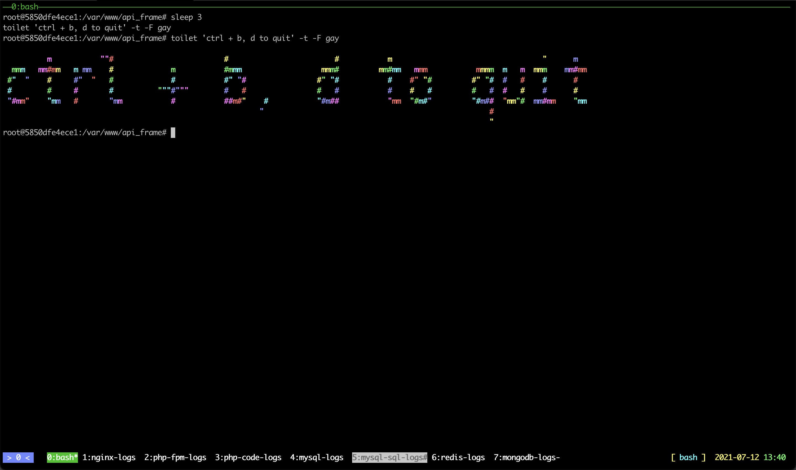
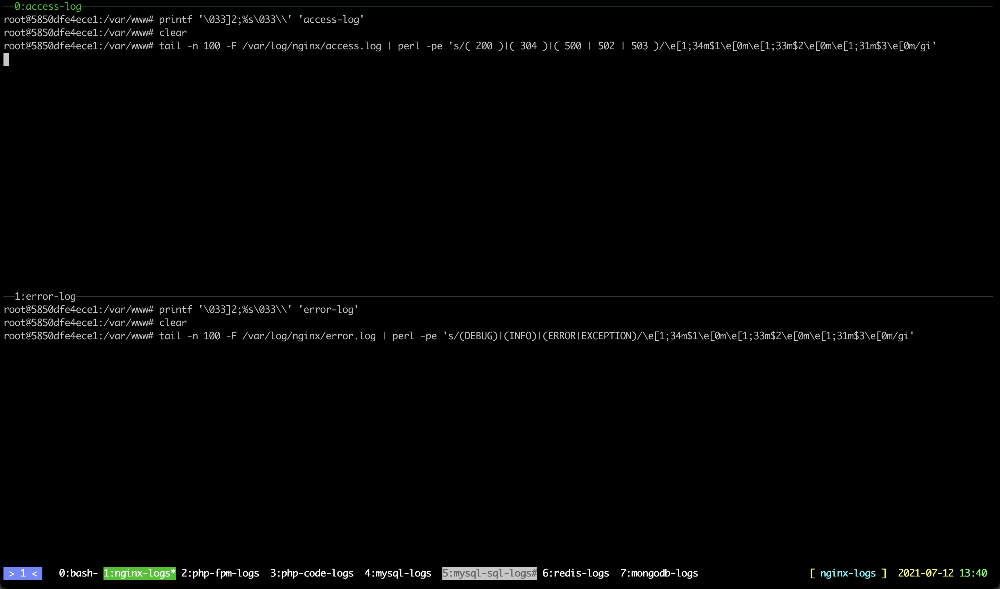
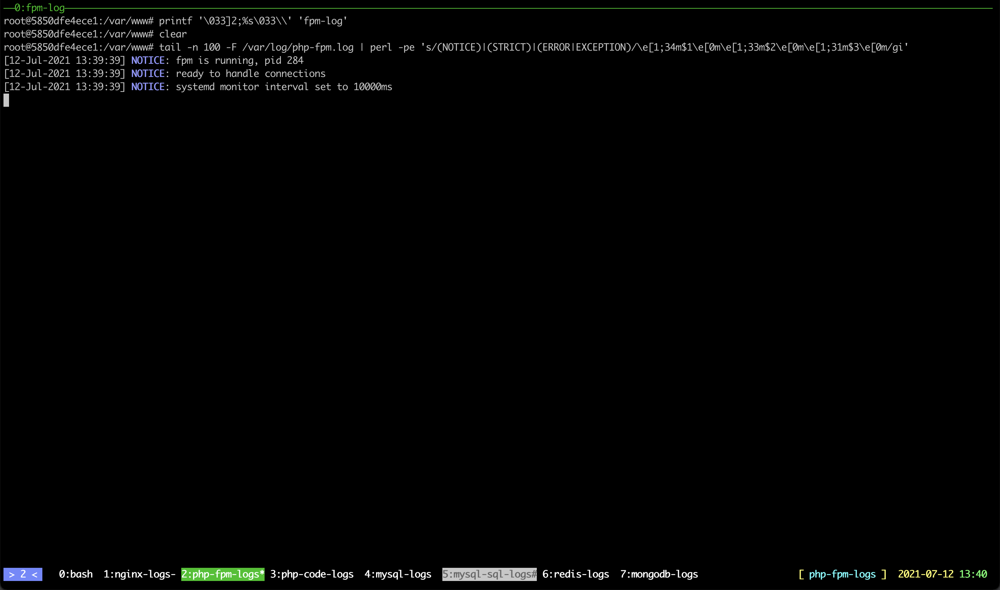
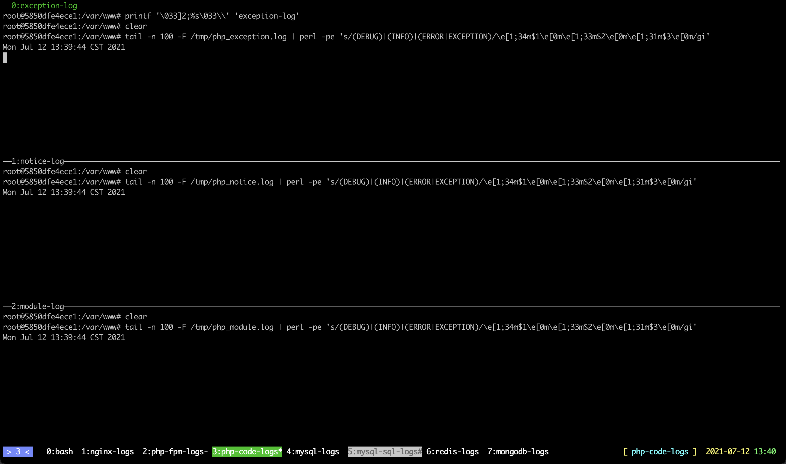
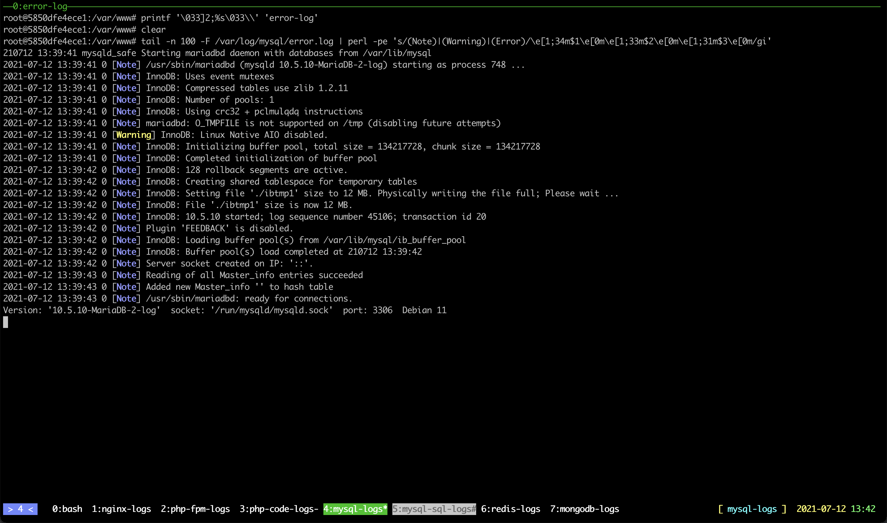
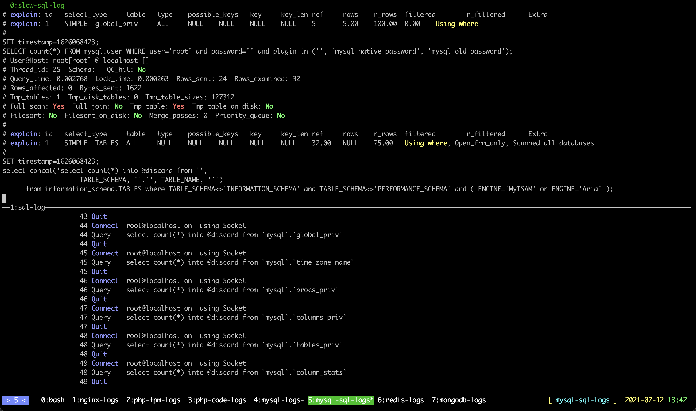
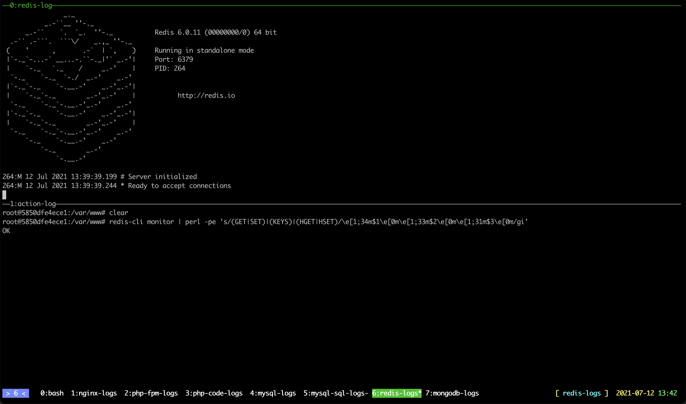
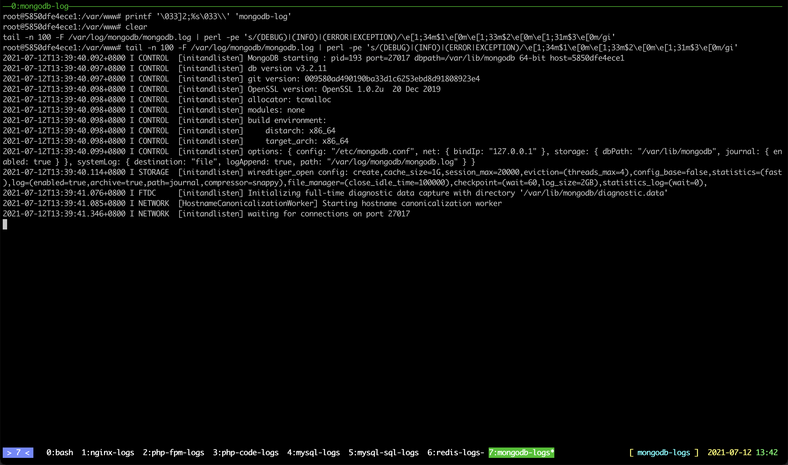

# 开发环境
框架中内置了一套基于 [debian_php_dev_env](https://github.com/smarty-kiki/debian_php_dev_env) 的 `docker` 的开发环境，对 `linux`、`mac` 用户格外友好，使用有如下两个步骤：

## 安装步骤
### 1. 安装 `docker` 环境
安装包及安装过程参考 [docker 官网](https://hub.docker.com/search/?type=edition&offering=community)

### 2. 开发机上安装 `git`
建议网上自行搜索，`mac` 操作系统自带

### 3. 在开发机执行框架目录中的环境启动脚本
```bash
sh project/tool/start_development_server.sh
```
这个脚本会自动拉取项目依赖的框架、`pull` 开发环境镜像、启动开发环境容器最终进入到开发环境中的 `tmux` 窗口

此步骤完毕就可以在浏览器中打开 [http://127.0.0.1/](http://127.0.0.1/) 看到 'hello world' 了，容器同时映射了 `3306` 端口到开发机，可以直接使用客户端工具连接 `127.0.0.1` 的 `3306` 端口来操作数据库。如果需要停止开发环境的使用，直接在该脚本终端按 `ctrl+b` 放开再按 `d` 终止脚本，每次脚本启动是一个全新的容器，如若需要从外部再次进入已启动的容器进行操作，可使用 `docker exec` 命令，如:
```bash
docker exec -ti api_frame /bin/bash
```
其中 `api_frame` 为容器名

## 开发环境介绍
环境启动后，可以看到底部有鼠标点击可切换的 `8` 个 `tab`

### 界面说明
#### `0:bash`
环境启动后默认会聚焦在 `0:bash`，这个是容器中的 linux 命令行，当前目录已经是项目根目录



#### `1:nginx-logs`
这个 `tab` 中上半部分是 `nginx access log`，已经进入了 `tail -f` 状态，有新日志会滚动展示，高亮了状态码 `200` 为蓝色、`304` 为黄色、`500` `502` `503` 为红色，方便快速定位问题行，下半部分是 `nginx error log`，同样进入了 `tail -f` 状态，高亮了 `DEBUG` 关键词为蓝色、`INFO` 为黄色、`ERROR` `EXCEPTION` 为红色



#### `2:php-fpm-logs`
这个 `tab` 是 `php-fpm` 的日志，进入了 `tail -f` 状态，高亮了 `NOTICE` 关键词为蓝色、`STRICT` 为黄色、`ERROR` `EXCEPTION` 为红色



#### `3:php-code-logs`
这个 `tab` 下有三个部分，都是框架输出的日志，分别是框架 `log_notice`、`log_module`、`log_exception` 所输出的内容，都进入了 `tail -f` 状态，高亮了 `DEBUG` 关键词为蓝色、`INFO` 为黄色、`ERROR` `EXCEPTION` 为红色



#### `4:mysql-logs`
这个 `tab` 是 `mysql` 的服务日志，进入了 `tail -f` 状态，高亮了 `Note` 关键词为蓝色、`Warning` 为黄色、`Error` 为红色



#### `5:mysql-sql-logs`
这个 `tab` 是 `mysql` 的 `sql` 日志，分两部分，上半部分是慢查询（超过 `0.5` 秒）和未命中索引查询 `sql` 日志，高亮了 `explain` 关键词为蓝色、`Using where` 为黄色、`No` 为红色、`Yes` 为绿色。下半部分为环境中所有的 `sql` 执行记录，高亮了 `Close stmt` `Quit` `Connect` 关键词为蓝色、`Execute` 为黄色、`ROLLBACK` 为红色



#### `6:redis-logs`
这个 `tab` 是 `redis` 的日志，分两部分，上半部分是 `redis` 自身的日志，高亮了 `DEBUG` 关键词为蓝色、`INFO` `WARNING` 为黄色、`ERROR` `EXCEPTION` 为红色。下半部分为环境中所有的 `redis` 命令执行记录，高亮了 `GET` `SET` 关键词为蓝色、`KEYS` 为黄色、`HGET` `HSET` 为红色



#### `7:mongodb-logs`
这个 `tab` 是 `mongodb` 的服务日志，进入了 `tail -f` 状态，高亮了 `DEBUG` 关键词为蓝色、`INFO` 为黄色、`ERROR` `EXCEPTION` 为红色



### 框架中的开发辅助工具