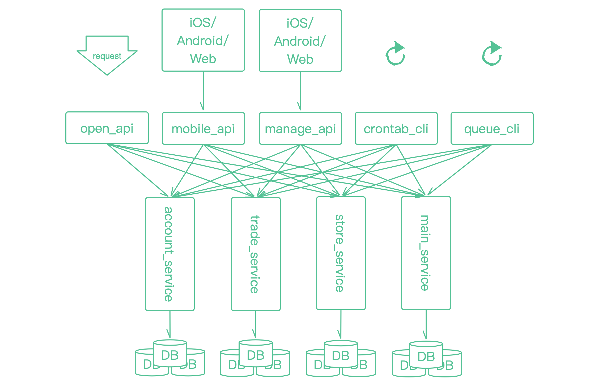

# 组合成果

开发者可以基于 `frame` 组合解决不同问题的框架，这里有一些已经组合好的框架供大家来快速使用。

### 面向单体、小型应用的快速开发框架

[api_frame](https://github.com/smarty-kiki/api_frame) 适合做接口项目，具有 `HTTP` 响应、缓存、存储、ORM、队列、命令行等能力  
[mvc_frame](https://github.com/smarty-kiki/mvc_frame) 适合做后端渲染页面的项目，具有 `HTTP` 响应、模版引擎、缓存、存储、`ORM`、队列、命令行等能力  

### 面向分布式系统的开发框架

在分布式系统中，往往分为接入层、应用层、服务层三层  

如图中的 `iOS/Android/Web` 为接入层，这层执行在用户侧，`HTTP` 请求到服务器上的应用层，如 `mobile_api`、`manage_api`，应用层调用服务层所提供的能力来完成具体的业务场景，服务层如 `account_service`，这里已经组合好供大家实现分布式架构中不同节点的框架  

分布式应用层：[distributed_api_frame](https://github.com/smarty-kiki/distributed_api_frame)  [distributed_mvc_frame](https://github.com/smarty-kiki/distributed_mvc_frame)  [distributed_cli_frame](https://github.com/smarty-kiki/distributed_cli_frame)  
分布式服务层：[distributed_service_frame](https://github.com/smarty-kiki/distributed_service_frame)  
